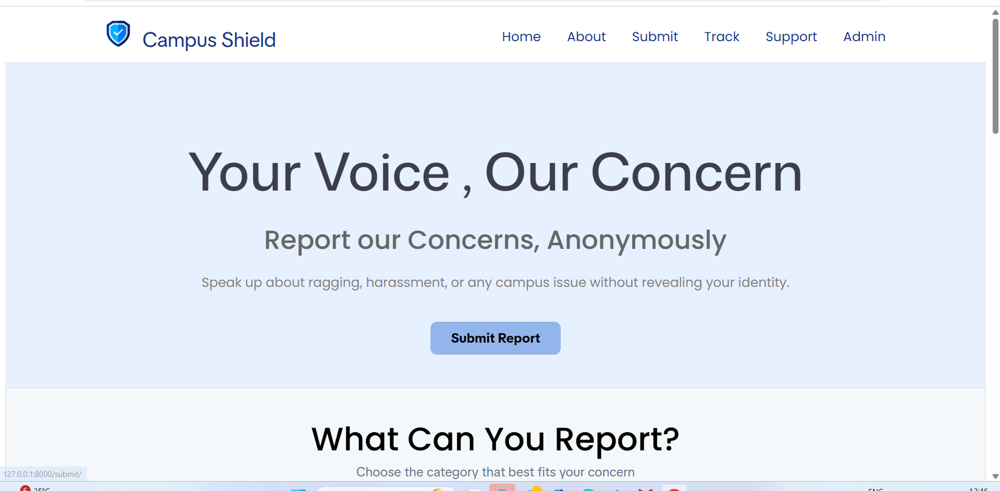
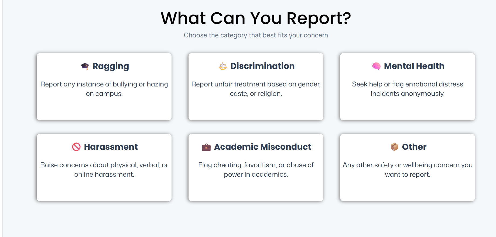
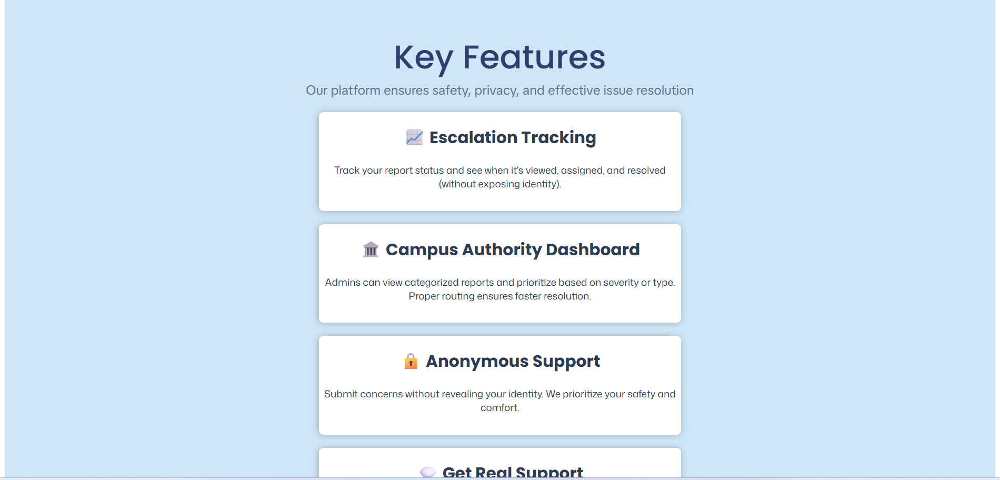
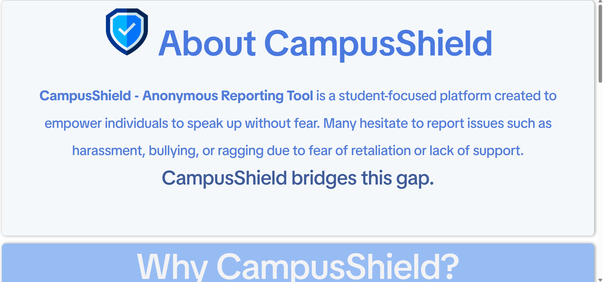
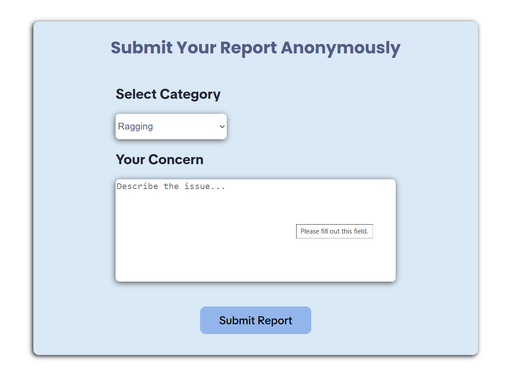
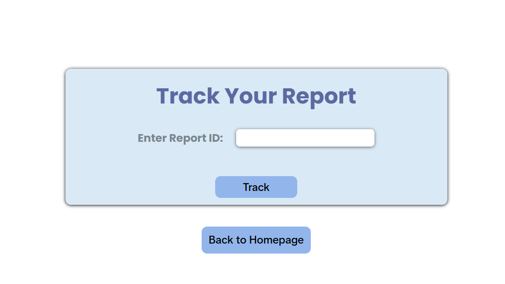
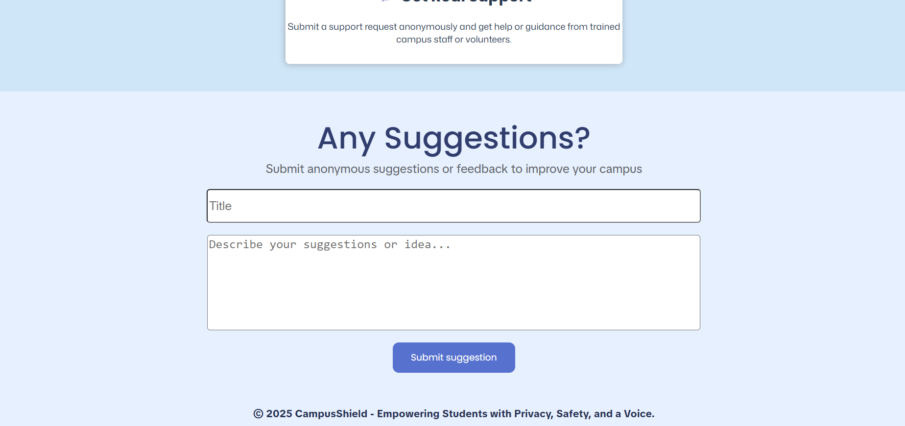

# 🛡️ CampusShield – Anonymous Reporting Tool

CampusShield is a secure, anonymous reporting platform built to empower students and faculty to safely report campus issues such as harassment, misconduct, or other concerns without fear. Designed for hackathons and real-world campus environments, CampusShield is simple, private, and powerful.

---

## 🚀 Features

- ✅ **Anonymous Report Submission** – No login required to report.
- 📨 **Track Your Report** using a unique Report ID.
- 💡 **Submit Suggestions** to improve campus environment.
- 👨‍🏫 **Faculty Login Dashboard** to view and resolve reports.
- 📬 **Direct Email Support** via icon click.
- 🌐 **Modern UI with Smooth Scroll Animations** (HTML/CSS).
- 🔐 **Built with Django** for security and scalability.

---

## 🖥️ Tech Stack

| Layer          | Technology        |
|----------------|-------------------|
| Frontend       | HTML, CSS         |
| Backend        | Django (Python)   |
| Database       | SQLite (default)  |
| Hosting        | Localhost         |

---


## 📸 Screenshots

### 🔹 Homepage (Scrolling View)





---

### 🔹 About CampusShield



---

### 🔹 Submit Report Page



---

### 🔹 Track Report Page



---

### 🔹 Suggestion Page




---

## 🧪 How to Run Locally

1. **Clone this repo:**
   ```bash
   git clone https://github.com/Poonam1237/CampusShield
   cd CampusShield
